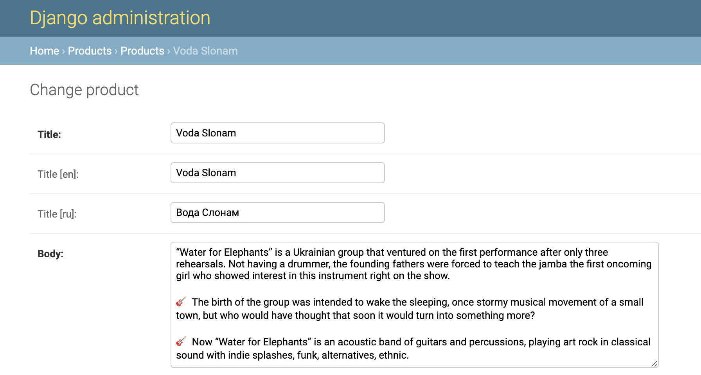

# Project description

This website gives an opportunity for the young projects of Marganets city to become recognizable and get new fans.
The type of project can be diverse: music band / public institution / any creative or other association.

Unauthorized users can just view the list of the projects and details of any project.  
Authorized users can create new projects and vote.

The website provides support of 2 languages: English (default) and Russian.

**Below** you'll find a comprehensive description of all website features.  

## Technical details

Website is built on the _Django 2.2_ web framework.
The project consists of 3 apps: the main one, `accounts` (users functionality) and `products` (projects functionality).  

_Bootstrap 4_ is used to simplify frontend work. 

_Sqlite 3_ is used as a production database. _Postgres_ was used for the development process.  
I don't use Postgres in production because of hosting limitations.
 
Project is covered with unit tests.

## Navigation bar

Navbar contains the logo, website title, language chooser and actions
(Sign Up and Login for unauthorized users and Create(plus) and Logout for authorized).

## Home page

This is the index page that shows all the projects and total votes on them.
Projects are shown in decreasing order of votes.
If two projects have the same number of votes - the newer one is shown first.

Here pagination comes into play: all projects are divided into pages. A page contains 5 projects.
User can navigate through the pages easily with the interface or changing the URL.

Titles of the projects are clickable and redirect to the project's detail page.
Descriptions are shortened to 3 lines. Images are centered and cropped.

There are some edge cases, read about them in the according section.

## Detail page

The project's detail page has the next elements:
* small image of the project (so-called icon)
* title (clickable and opens project's website)
* big image
* upvote button and info message below it
* description of the project
* creator's username
* publishing date

I'd like to say a little bit more about **Upvote** button.  
When a project is created it already has 1 vote (from the creator).
That's why the user cannot vote on his own projects.
On other's projects, the user can vote only once (appropriate info message is shown).

The voting limit is achieved not only disabling the button. 
`/upvote` endpoint has appropriate checks also and raises 404 error in case of violation.  

This comprehensive logic is covered by tests.

## Other pages

There are other pages: Sign Up, Login and Create project.
They are simple forms that gather user's data and deliver it to the server.
The server handles all necessary data checks (such as passwords should not be equal when registering new user).
Of course, all such checks are covered by tests. 

## Edge cases

### There are no projects yet

User is unauthorized:

User is authorized:

### Data validations

All endpoints that receive some data from the user, validate it and show an appropriate error message
or raise 404 error.

All validations are covered with the tests.

## Admin panel

Django admin panel is supported. There are possibilities to manage users and projects (any actions are supported).  

Translations managing is also supported.

# Upwork

This project is part of my Upwork portfolio.
Please check my [Upwork profile](https://www.upwork.com/o/profiles/users/_~010104bbdffc992d66/?s=1110580748673863680) in order to reach to other projects.

Btw, I'm available for freelance work! 
